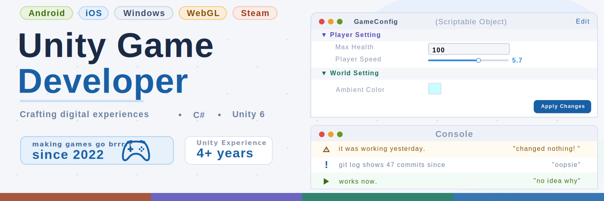

👋 Hi, I am Sagar. I'm a self-taught Unity Developer who loves to play and build games.
> 15+ years of playing games, 4+ years of making them. I know what makes __us__ stay.

- 🛠️ Currently, I am working on __Editor Extensions__ to optimize the development workflow in unity.
- 🎮 catch me bottom fragging in __VALORANT__ or hanging out in discord communities.

👩‍💻 Check out my [portfolio](https://beginplay.me) to learn more about my work.

📄 Resume: [Download PDF](https://beginplay.me/assets/Sagar_Unity_Developer_Resume.pdf)

---

### 📫 How to reach me

> Email:
> ```
> sagar@beginplay.me
> ```

[](https://www.linkedin.com/in/s4g4rkumar/)
[](https://steamcommunity.com/id/ghost_47_cs/)
[](https://www.instagram.com/catscancode/)
[](https://twitter.com/cats_can_code)


---

## 🛠️ Languages and Tools

[](https://learn.microsoft.com/dotnet/csharp/)
[](https://docs.unity3d.com/Manual/UIE-UXML.html)
[](https://docs.unity3d.com/Manual/UIE-USS.html)
[](https://developer.mozilla.org/docs/Web/HTML)
[](https://developer.mozilla.org/docs/Web/CSS)
[](https://developer.mozilla.org/docs/Web/JavaScript)
[](https://www.markdownguide.org/)
[](https://isocpp.org/)

[](https://unity.com/)
[](https://www.blender.org/)
[](https://inkscape.org/)
[](https://www.unrealengine.com/)
[](https://www.jetbrains.com/webstorm/)
[](https://www.jetbrains.com/rider/)

[](https://subversion.apache.org/)
[](https://git-scm.com/)
[](https://github.com/)


[](https://aws.amazon.com/)
[](https://play.google.com/console)
[](https://www.jenkins.io/)
[](https://www.atlassian.com/software/jira)
[](https://trello.com/)
[](https://slack.com/)

---

### 📚 What I'm tinkering with
- UI toolkit and themes.
- The new Input System.
- Shader programming and visual effects in URP.
- Procedural content generation techniques.

---

### 🚀 Next in the pipeline
- ECS and DOTS for high-performance gameplay.
- Multiplayer and networking.


---

